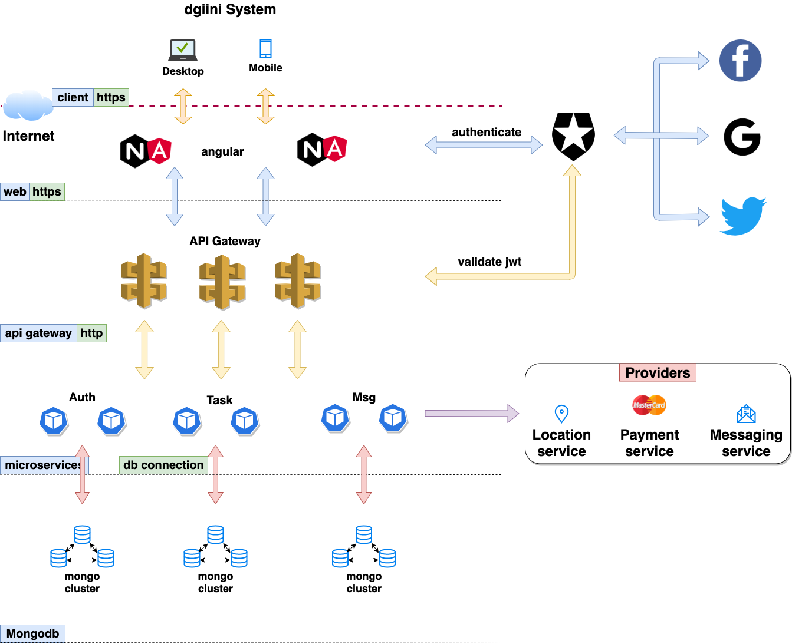

# :::: dgiini

## dgiini web application (SPA)

Application desgined using microservice architecture with SPA front-end and mongo db database. Apps has the followings microservices

* Authentication microservice
* Task microservice
* Message microservice
* Notify microservice
* Billing microservice

Architecture is as shown below


## Pre-requisite package version

```none
nodejs -> 13.7.0
yarn -> 1.12.1
angular -> in package file
typescript ->  in package file
```

## Provider Services

* Location
* Payment
* Messaging
  * Email
  * SMS

## Local Dev Run

### > Web

## Prerequisite

```bash
#!/bin/bash
$ cd web
$ npm install

or

$ yarn
```

and run web app

```bash
#!/bin/bash
$ ng serve
```

### > microservices

#### microservice Prerequisite

```bash
#!/bin/bash
$ cd ms
$ yarn dev src/task.api &

$ yarn dev src/msg.api &

$ yarn dev src/auth.api &

$ yarn dev src/notify.api &
```

### > api gateway

```bash
$ yarn start

or

$ nodemon start --watch config/gateway.config.yml
```

## Unit Test

### microservices

```bash
yarn test test/unit

```

## Integration Test

```bash
yarn test test/int

```

## Postman

```bash
newman run postman/collection.json -e postman/environment.json -k

```

## CI/CD Build

```bash
$ curl http://gru:8088/git/notifyCommit?url=ssh://jenkins@scarlet/projects.git/projects/dgiini

or

ssh -l murpheux -p 53801 gru build dgiini -p deploy=false -p branch=dev

or

$ .build/jenkins/build.sh
```

## Database

Recommended database of choice is mongodb or any other related document database provided by the adopted cloud provider.

### Connect to database

```bash
#!/bin/bash
mongo --host <database hostname or ip address>
```

### Drop database

```mongo
use <database name>
db.dropDatabase()
```

### Dump Database

```mongo
mongodump --host gru -d dg_taskdb -o task$(date +%s)
mongodump --host gru -d dg_authdb -o auth$(date +%s)
mongodump --host gru -d dg_messagedb -o msg$(date +%s)
```

### Load database dump

1. Download and unzip archived dump file.
2. Restore the dump into your local mongo:

```bash
#!/bin/bash
mongorestore --host gru -d dg_taskdb task0730474/
mongorestore --host gru -d dg_authdb auth0730475/
mongorestore --host gru -d dg_messagedb msg0730476/
```

### Data Generation

mongodb-dataset-generator is an npm package and is used for the generation of sample raw data in dev and test for the purpose of testing.

This can be aliased to "mgen"

```bash
#!/bin/bash
alias mgen=mongodb-dataset-generator
```

```bash
#!/bin/bash
$ mgen deploy/data/task_schema.json -n 10 -o tmp/task.json
```

#### Upload generated data to mongodb

```bash
#!/bin/bash
$ mongoimport --host gru --db dg_taskdb --collection tasks --file tmp/task.json  --jsonArray
```

...Note: --jsonArray is important

#### Database Configuration - Replica Set

Replica Set architecture


```mongo
rs.initiate({
    "_id": "dbrepl",
    "members": [{
            "_id": 0,
            "host": "dgiinidb0:27017"
        },
        {
            "_id": 1,
            "host": "dgiinidb1:27017"
        },
        {
            "_id": 2,
            "host": "dgiinidb2:27017"
        }
    ]
})
```

Check replicaset configuration

```mongo
rs.conf()
rs.status()
```

## Create Text index

In mongodb, in order to do a text search, text indexes need to be created

```mongo
db.tasks.getIndexes()
db.tasks.createIndex( { title: "text", description: "text" } )

then, this can work

db.tasks.find({ $text: { $search: "Need Cleaning" } })
```

## Configuring Environment Variables

Environment variables provided by .env file for micro-services. This can be overriden in any environment with equivalent environment variables.

Refer to .env file for details of environment variables.

## Common Errors

## MongoError: text index required for $text query
